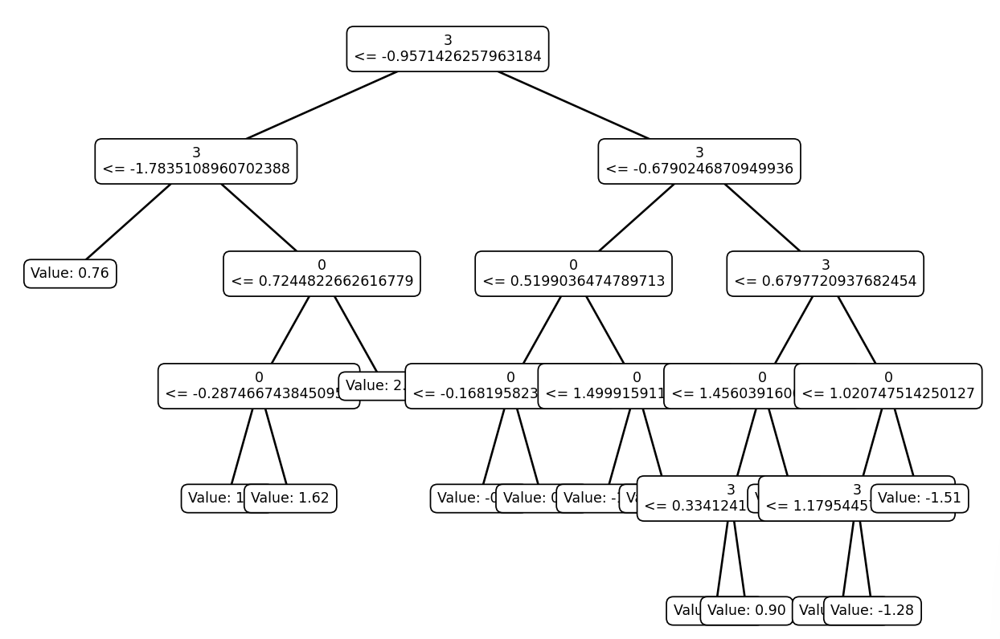
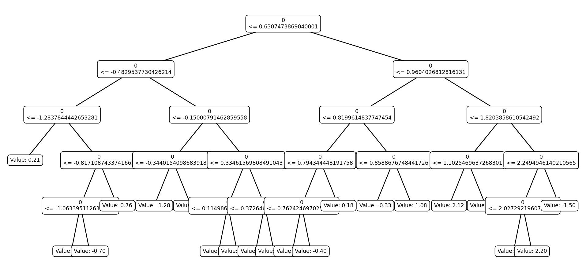
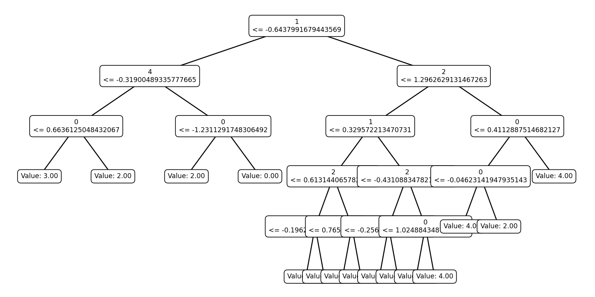
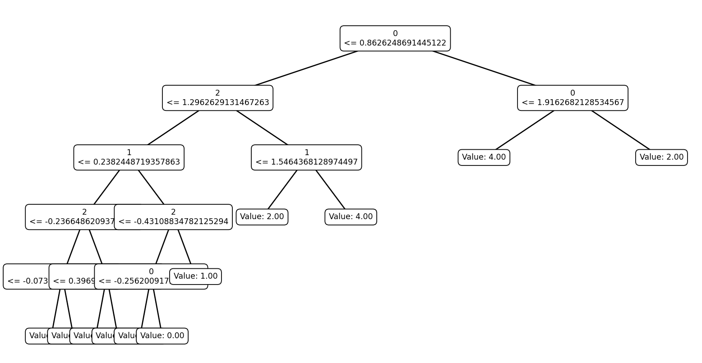
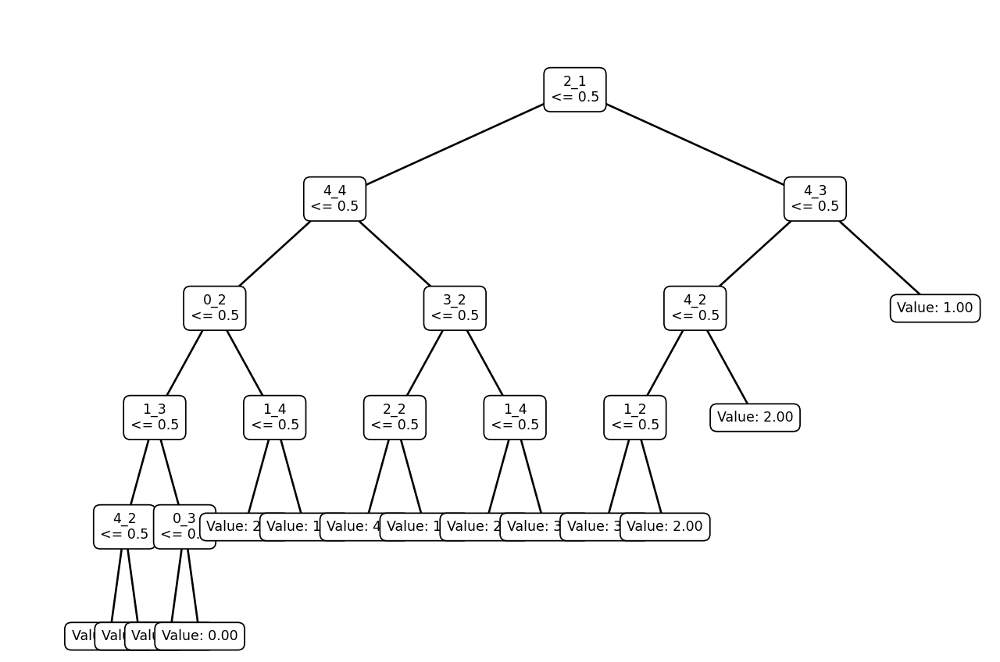
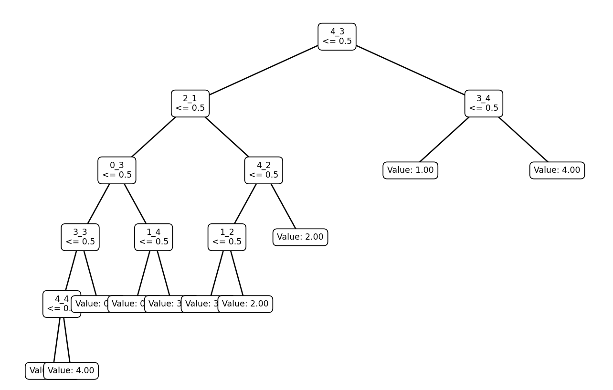
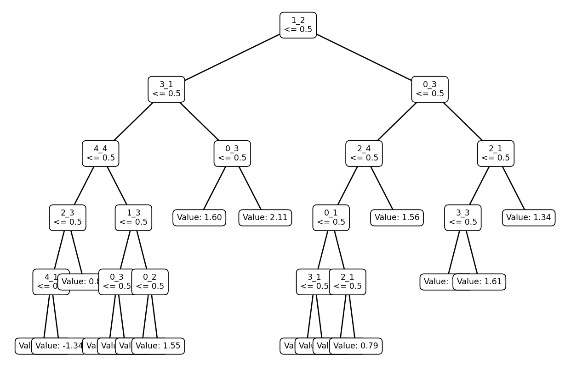
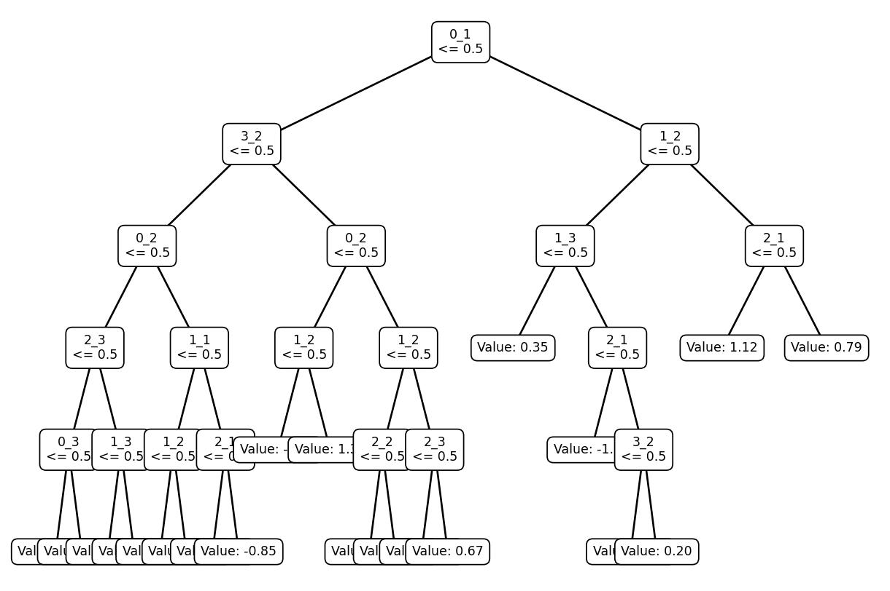
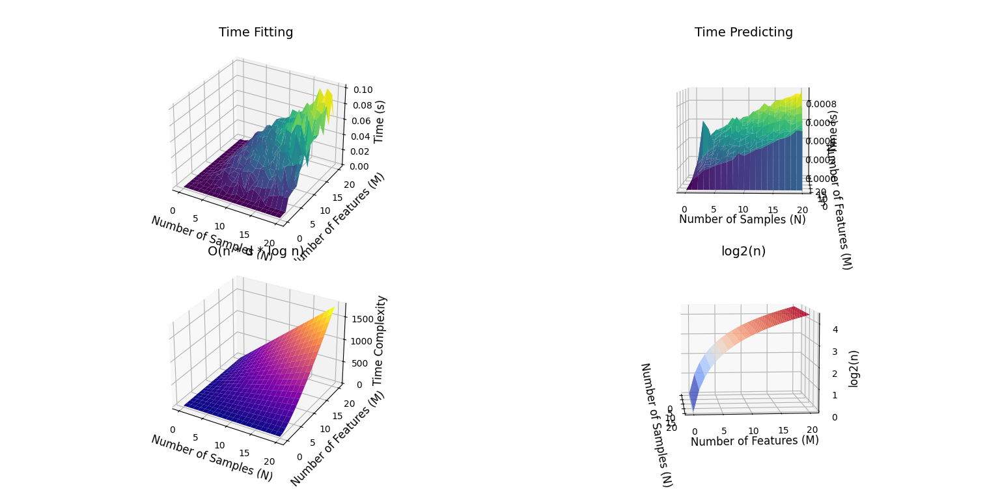

## Graphs from `usage.py`

### Real Input and Real Output

- **With Information Gain as Criteria**  
  

- **With Gini Index as Criteria**  
  

### Real Input and Discrete Output

- **With Information Gain as Criteria**  
  

- **With Gini Index as Criteria**  
  

### Discrete Input and Discrete Output

- **With Information Gain as Criteria**  
  

- **With Gini Index as Criteria**  
  

### Discrete Input and Real Output

- **With Information Gain as Criteria**  
  

- **With Gini Index as Criteria**  
  

---

## Decision Tree Classifier Performance

### First Class

**Overall Metrics**
- **Accuracy**: 90.0%
- **Precision**: 0.9286
- **Recall**: 0.8667
- **Second Precision**: 0.8750
- **Second Recall**: 0.9333

**Cross-Validation Accuracy**
- **Fold 1**: 0.8500
- **Fold 2**: 0.5000
- **Fold 3**: 0.8000
- **Fold 4**: 1.0000
- **Fold 5**: 0.8000
- **Mean Accuracy**: 0.79

**Additional Statistics**
- **Overall Accuracy**: 93.0%
- **Standard Deviation**: 0.0400

### Second Class

**Overall Metrics**
- **Accuracy**: 50.0%
- **Precision**: 0.5789
- **Recall**: 0.6111
- **Second Precision**: 0.3636
- **Second Recall**: 0.3333

**Cross-Validation Accuracy**
- **Fold 1**: 0.7000
- **Fold 2**: 0.5500
- **Fold 3**: 0.5000
- **Fold 4**: 0.8000
- **Fold 5**: 0.5000
- **Mean Accuracy**: 0.61

**Additional Statistics**
- **Overall Accuracy**: 73.0%
- **Standard Deviation**: 0.0980

---

## Results from Auto - Efficiency 

**Our Model**

- **RMSE**: 4.189785650539697
  
**SK-Learn Model**

- **RMSE**: 3.3806036461937135

---

## Runtime Complexity Analysis

### For Fitting 

The time complexity for fitting a dataset into a Decision Tree is **O(n * m * log(n))** where **n** is the number of rows in the dataset and **m** is the number of features used for fitting.

For predicting, the time complexity is of the order **O(log(n))** or **O(h)**, where **h** is the maximum depth of the decision tree, whichever is lower.

Here is a plot from our analysis:
 

The plot for both fitting and predicting is matching the shape of theoretical graphs in essence.

---
